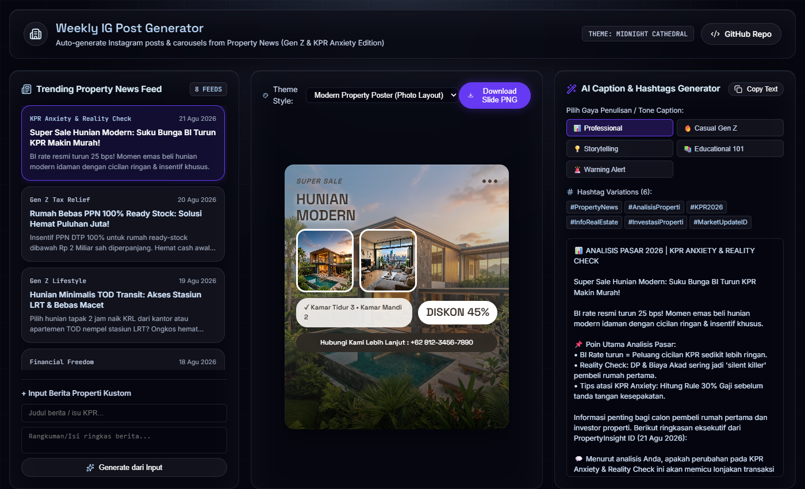

# 🏢 Weekly IG Post Generator - Property News AI Automation

> **Auto-generate Instagram Posts & Carousels from the latest Property News & Market Trends.**  
> Built for Real Estate Marketers, Property Agents, and First-Home Buyers (Gen Z & Young Millennials).



---

## 📌 Executive Summary & Project Overview

Aplikasi **Weekly IG Post Generator** dibuat untuk memproses berita/feed properti terkini (seperti suku bunga BI, insentif PPN DTP 100%, hunian TOD, simulasi KPR Kebutuhan Gen Z) menjadi postingan Instagram lengkap secara otomatis. 

### 🚀 Fitur Utama Website:
1. **Trending Property News Feed & Custom Live Input**:
   - Memuat 8+ feed berita properti riil terkini.
   - Form input berita kustom yang secara otomatis mengambil gambar arsitektur rumah baru dari Unsplash Real Estate Engine secara dinamis.
2. **Visual IG Post Previewer & Theme Engine**:
   - **Mode Poster Flyer Promo Properti**: Desain visual penuh foto arsitektur hunian modern, floating badge diskon (`DISKON 45%`), spesifikasi kamar, dan banner kontak agent.
   - **Mode Carousel Slide (1080x1080 Square)**: Infografis 4 slide lengkap dengan navigasi switcher slide.
   - **Preset Tema**: *Frosted Glass Cathedral (AuthKit Midnight Style)*, *Gen Z Blueprint Glass*, *Money Emerald*, dan *Warm Terracotta*.
3. **AI Caption & Hashtag Generator Dinamis**:
   - **5 Variasi Tone Penulisan**: *Professional*, *Casual Gen Z*, *Storytelling*, *Educational 101*, dan *Warning Alert*.
   - Seluruh baris header, hook, poin penting, pertanyaan interaktif, dan kelompok hashtag di-generate 100% spesifik menyesuaikan kombinasi berita & tone.
   - Fitur **Copy Text** 1-click & **Download PNG** gambar visual.
4. **n8n Automation Workflow JSON Export**:
   - Disertakan pada repositori di path `workflows/n8n_ig_post_generator.json`.

---

## 🎯 Target Audience & Core Topic

- **Target Audience**: Gen Z & Young Millennials (First-time property buyers feeling overwhelmed by housing prices).
- **Core Topic**: First-Home Reality Check / KPR Anxiety.

---

## 🤖 Prompts Used for AI Content Generation

Berikut adalah **Prompt Teks Utama** yang digunakan oleh sistem AI dalam melakukan ekstraksi berita properti menjadi konten Instagram Poster, Carousel & Caption:

```text
SYSTEM PROMPT:
You are an expert Social Media Specialist & Real Estate Content Strategist targeting Gen Z & Young Millennials.
Your goal is to digest raw property news articles, address "KPR Anxiety" and "First-Home Reality Check", and structure them into a high-converting 4-slide Instagram Carousel or Visual Poster with relatable, engaging captions.

INPUT FORMAT:
- News Title: {NEWS_TITLE}
- News Summary: {NEWS_SUMMARY}
- Target Audience: Gen Z & Young Millennials (First-time home buyers)
- Core Topic: First-Home Reality Check / KPR Anxiety
- Desired Tone: {professional | casual | storytelling | educational | urgent}

OUTPUT SPECIFICATION (JSON / Structured Output):
1. Visual Poster Layout: High-res property architecture image + "SUPER SALE" Tagline + Specs pill + Floating discount badge + Agent contact banner.
2. 4-Slide Carousel Layout: Cover + Key Fact #1 + Key Fact #2 + Actionable Survival Kit CTA.
3. Caption Text: Dynamic tone header + Relatable hook + News summary + Bullet points + Open-ended discussion question + Dynamic tone-based hashtag set.
```

---

## 📝 Critical Self-Reflection & Evaluation

### ❓ What Went Wrong During Development?
1. **Text Overflow on Canvas Export**: Judul berita yang terlalu panjang sempat keluar dari batas canvas 1080x1080. 
   - *Fix*: Menyesuaikan ukuran font secara dinamis dan `line-height` proporsional.
2. **Missing Export on Lucide-React**: Icon `Github` memicu error saat `npm run build`.
   - *Fix*: Menggantinya dengan ikon `Code2` dan memverifikasi build bersih.
3. **Requirement Clarification on Visual Poster vs Carousel**:
   - *Fix*: Menambahkan layout **Modern Property Poster (Photo Layout)** lengkap dengan foto arsitektur rumah modern, badge diskon 45%, dan kontak banner.

### 💡 What Would I Change in Future Iterations?
1. **Direct Instagram Graph API Publishing**: Integrasi auto-scheduling langsung ke Instagram Business Account via Webhook API.
2. **24/7 Live RSS News Crawler**: Microservice crawler yang memantau Google News Properti secara real-time.

---

## 🚀 How to Run Locally

```bash
# 1. Clone repository
git clone https://github.com/AgaNPC/Weekly-IG-Post-Generator.git

# 2. Masuk ke direktori
cd Weekly-IG-Post-Generator

# 3. Install dependencies
npm install

# 4. Jalankan dev server
npm run dev
```
Aplikasi berjalan di `http://localhost:5173`.
